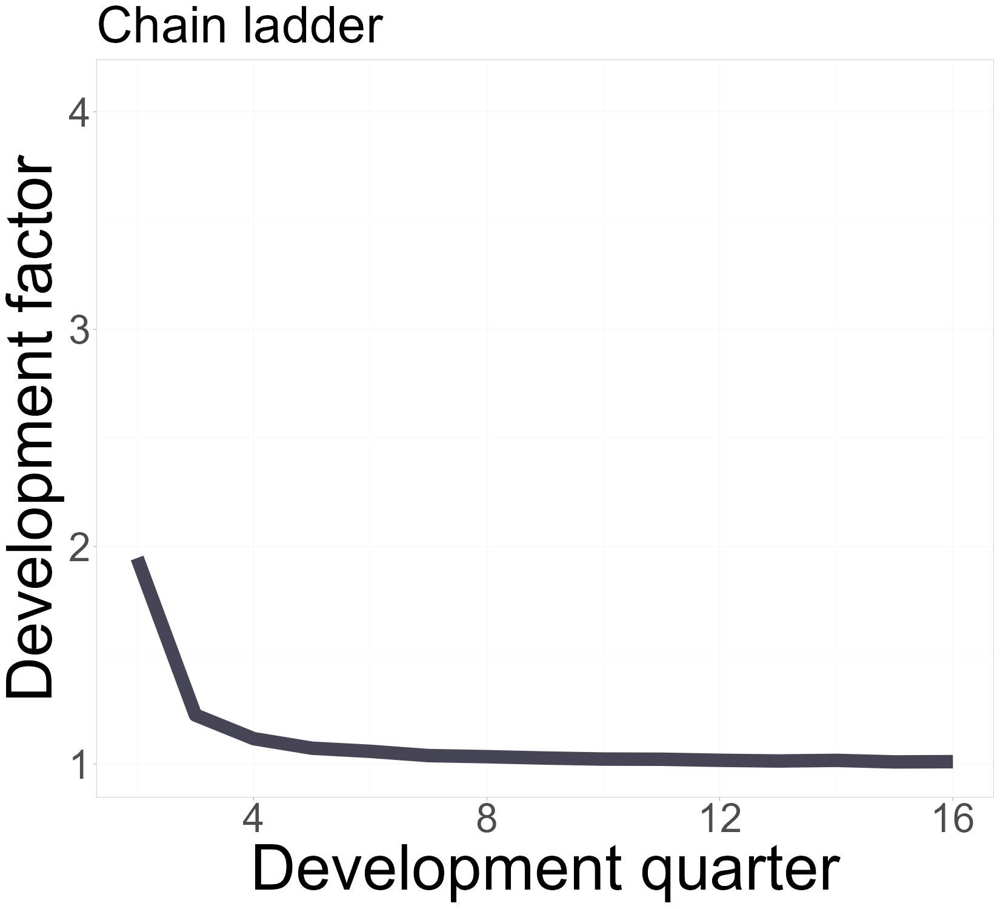
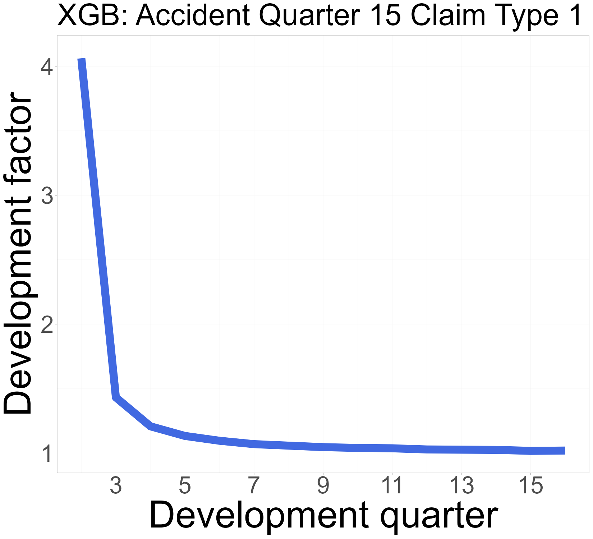
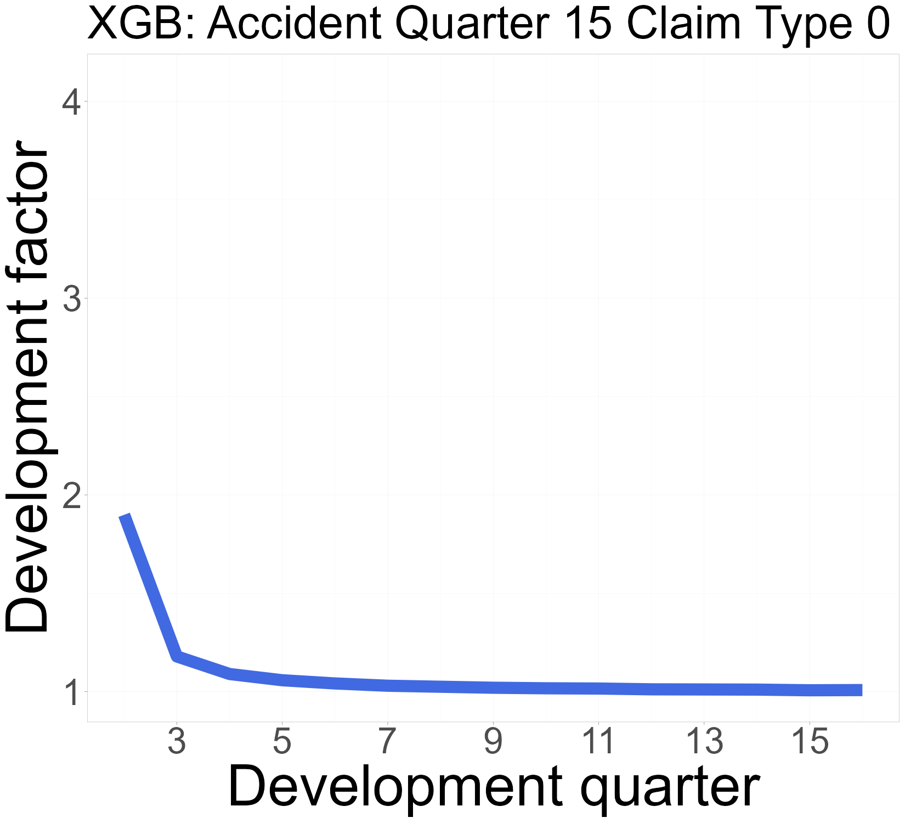
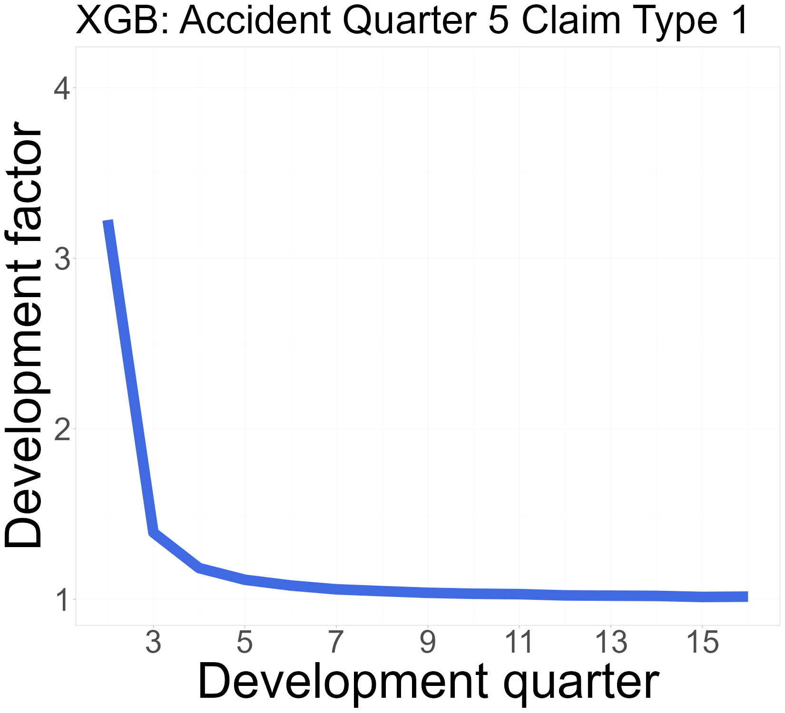
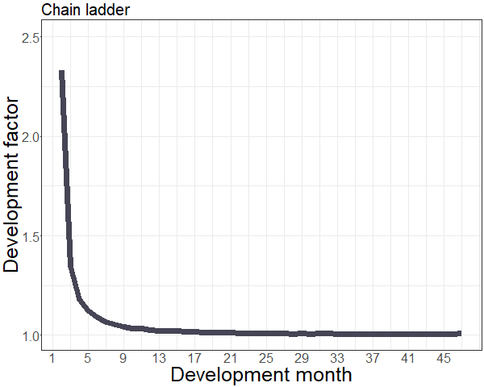
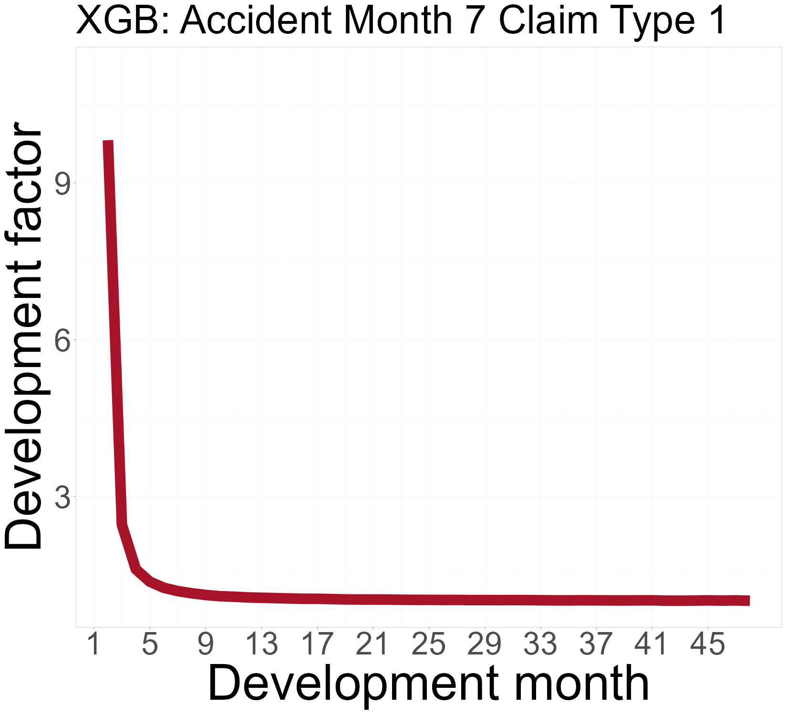
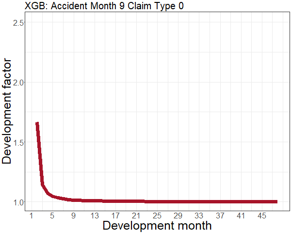
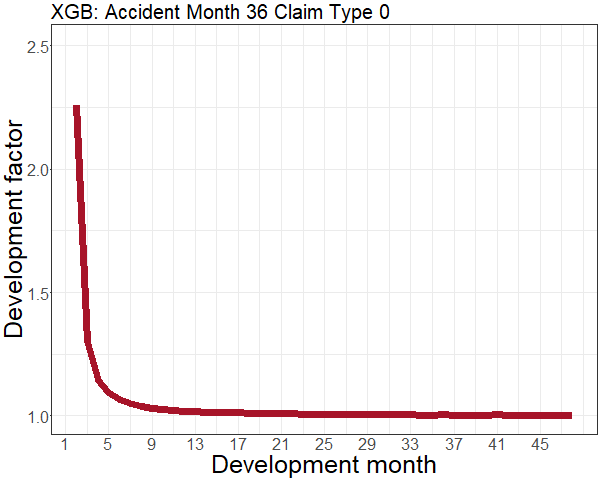
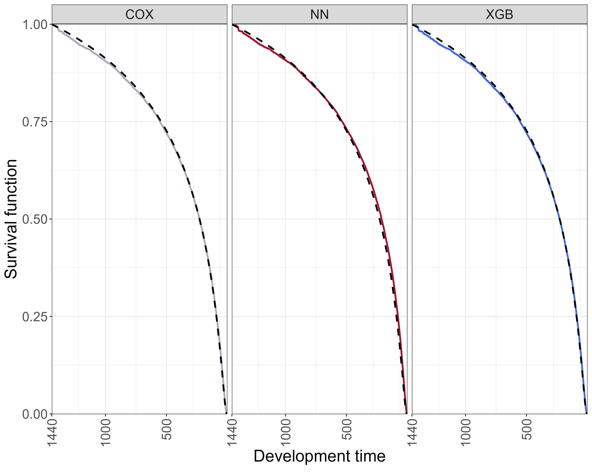
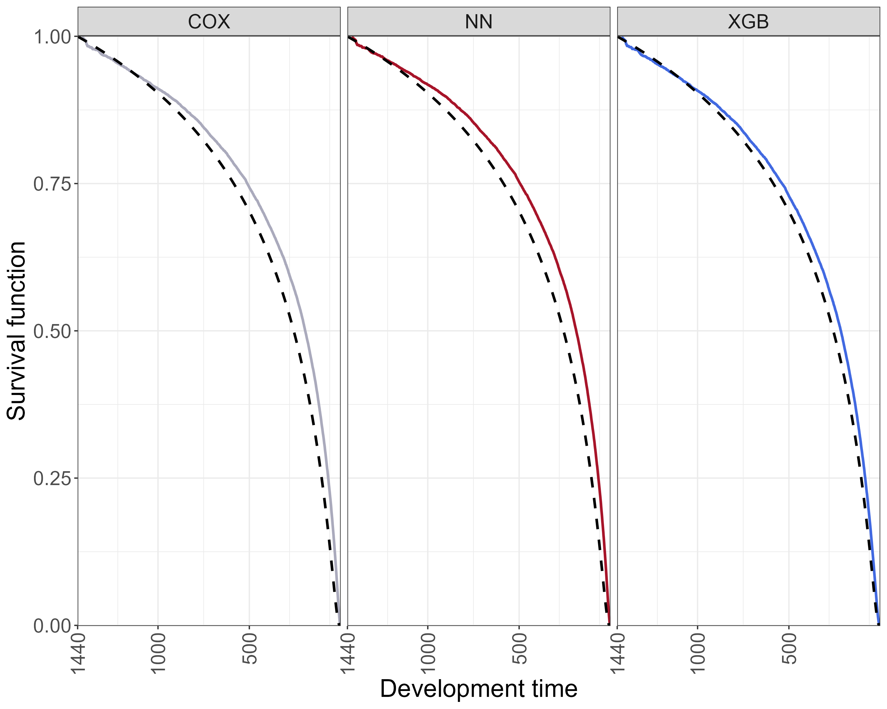

# Introduction

In this vignette, we provide the supplementary material to replicate the results of the manuscript **A machine learning approach based on survival analysis for IBNR frequencies in non-life reserving**.

We remark that the real data that we used to obtain the results that we included in the manuscript are private and will not be shared.

With reference to the code related to the simulation case study, we wanted to make this vignette quickly reproducible and drop extensive computations. The full code that we implemented can be found at the GitHub repository [resurv-replication-code](https://github.com/gpitt71/resurv-replication-code).

```{r eval=FALSE, echo=TRUE}

library(ReSurv)
library(data.table)

```


# Figure 1

```{r eval=FALSE, echo=TRUE}

input_data <- data_generator(random_seed = 7,
                             scenario=3,
                             time_unit = 1/360,
                             years = 4,
                             period_exposure = 200)


individual_data <- IndividualData(input_data,
                                  id="claim_number",
                                  continuous_features="AP_i",
                                  categorical_features="claim_type",
                                  accident_period="AP",
                                  calendar_period="RP",
                                  input_time_granularity = "days",
                                  output_time_granularity = "quarters",
                                  years=4,
                                  continuous_features_spline=NULL,
                                  calendar_period_extrapolation=F)

hparameters = list(params=list(booster="gbtree",
                               eta=0.2234094,
                               subsample=0.8916594,
                               alpha=12.44775,
                               lambda=5.714286,
                               min_child_weight=4.211996,
                               max_depth = 2),
                   print_every_n = 0,
                   nrounds=3000,
                   verbose=F,
                   early_stopping_rounds = 500)

```

```{r eval=FALSE, echo=TRUE}

resurv.fit <- ReSurv(individual_data,
                     hazard_model = "xgboost",
                     hparameters = hparameters)


resurv.fit.predict.Q <- predict(resurv.fit,
                                grouping_method = "probability")


individual_dataY <- IndividualData(input_data,
                                   id="claim_number",
                                   continuous_features="AP_i",
                                   categorical_features="claim_type",
                                   accident_period="AP",
                                   calendar_period="RP",
                                   input_time_granularity = "days",
                                   output_time_granularity = "years",
                                   years=4,
                                   continuous_features_spline=NULL,
                                   calendar_period_extrapolation=F)

resurv.fit.predict.Y <- predict(resurv.fit,
                                newdata=individual_dataY,
                                grouping_method = "probability")

individual_dataM <- IndividualData(input_data,
                                   id="claim_number",
                                   continuous_features="AP_i",
                                   categorical_features="claim_type",
                                   accident_period="AP",
                                   calendar_period="RP",
                                   input_time_granularity = "days",
                                   output_time_granularity = "months",
                                   years=4,
                                   continuous_features_spline=NULL,
                                   calendar_period_extrapolation=F)

resurv.fit.predict.M <- predict(resurv.fit,
                                newdata=individual_dataM,
                                grouping_method = "probability")


dtb_2_plot_M <- resurv.fit.predict.M$hazard_frame_output
dtb_2_plot_M=dtb_2_plot_M %>%
  mutate(DP_o=48-DP_rev_o+1)

dtb_2_plot_Q <- resurv.fit.predict.Q$hazard_frame_output

dtb_2_plot_Q=dtb_2_plot_Q %>%
  mutate(DP_o=16-DP_rev_o+1)

dtb_2_plot_Y <- resurv.fit.predict.Y$hazard_frame_output

dtb_2_plot_Y=dtb_2_plot_Y %>%
  mutate(DP_o=4-DP_rev_o+1)
```


## Figure 1b

```{r eval=FALSE, echo=TRUE}
CL = resurv.fit$IndividualData$training.data %>%
  mutate(DP_o = max(resurv.fit.predict.Q$hazard_frame_output$DP_rev_o)-DP_rev_o + 1) %>%
  group_by(AP_o, DP_o) %>%
  summarize(I=sum(I), .groups="drop") %>%
  group_by(AP_o) %>%
  arrange(DP_o) %>%
  mutate(I_cum = cumsum(I),
         I_cum_lag = lag(I_cum, default=0)) %>%
  ungroup() %>%
  group_by(DP_o) %>%
  reframe(df_o = sum(I_cum*(AP_o<=max(resurv.fit$IndividualData$training.data$AP_o)-DP_o+1)) /
            sum(I_cum_lag*(AP_o<=max(resurv.fit$IndividualData$training.data$AP_o)-DP_o+1)),
          I=sum(I*(AP_o<=max(resurv.fit$IndividualData$training.data$AP_o)-DP_o))) %>%
  mutate(DP_o_join = DP_o-1) %>%as.data.frame()

# Figure 1a ----

CL %>%
  filter(DP_o>1) %>%
  ggplot(aes(x=DP_o,
             y=df_o))+
  geom_line(linewidth=2.5,color="#454555") +
  labs(title="Chain ladder",
       x = "Development quarter",
       y = "Development factor") +
  ylim(1,max(dtb_2_plot_Q$df_o)+.01)+
  theme_bw(base_size=rel(5))+
  theme(plot.title = element_text(size=20))

ticks.at <- seq(1,16,by=2)
labels.as <- as.character(ticks.at)
```


## Figure 1f

```{r eval=FALSE, echo=TRUE}
# Figure 1c ----

ap=15
ct=1
dtb_2_plot_Q %>%
  filter(claim_type==ct,
         AP_o==ap,
         DP_o>1) %>%
  ggplot(aes(x=DP_o,
             y=df_o))+
  geom_line(linewidth=2.5,color="royalblue") +
  ylim(1,max(dtb_2_plot_Q$df_o)+.01)+
  labs(title=paste("XGB: Accident Quarter", ap, "Claim Type", ct),
       x = "Development quarter",
       y = "Development factor") +
  scale_x_continuous(breaks = ticks.at,
                     labels = labels.as) +
  theme_bw(base_size=rel(5))+
  theme(plot.title = element_text(size=20))


```




## Figure 1g

```{r eval=FALSE, echo=TRUE}
# Figure 1d ----

ap=12
ct=0
dtb_2_plot_Q %>%
  filter(claim_type==ct,
         AP_o==ap,
         DP_o>1) %>%
  ggplot(aes(x=DP_o,
             y=df_o))+
  geom_line(linewidth=2.5,color="royalblue") +
  ylim(1,max(dtb_2_plot_Q$df_o)+.01)+
  labs(title=paste("XGB: Accident Quarter", ap, "Claim Type", ct),
       x = "Development quarter",
       y = "Development factor") +
  scale_x_continuous(breaks = ticks.at,
                     labels = labels.as) +
  theme_bw(base_size=rel(5))+
  theme(plot.title = element_text(size=20))

```




## Figure 1h


```{r eval=FALSE, echo=TRUE}

ap=16
ct=0
dtb_2_plot_Q %>%
  filter(claim_type==ct,
         AP_o==ap,
         DP_o>1) %>%
  ggplot(aes(x=DP_o,
             y=df_o))+
  geom_line(linewidth=2.5,color="royalblue") +
  ylim(1,max(dtb_2_plot_Q$df_o)+.01)+
  labs(title=paste("XGB: Accident Quarter", ap, "Claim Type", ct),
       x = "Development quarter",
       y = "Development factor") +
  scale_x_continuous(breaks = ticks.at,
                     labels = labels.as) +
  theme_bw(base_size=rel(5))+
  theme(plot.title = element_text(size=20))
ggsave("C:\\Users\\gpitt\\Pictures\\ReSurv\\XGBdfoquarters2c.eps",
       width = 5.5,
       height= 5,
       device=cairo_ps)


```



## Figure 1a

```{r eval=FALSE, echo=TRUE}
ticks.at <- seq(1,48,4)
labels.as <- as.character(ticks.at)


CL_months = individual_dataM$training.data %>%
  mutate(DP_o = max(resurv.fit.predict.M$hazard_frame_output$DP_rev_o)-DP_rev_o + 1) %>%
  group_by(AP_o, DP_o) %>%
  summarize(I=sum(I), .groups="drop") %>%
  group_by(AP_o) %>%
  arrange(DP_o) %>%
  mutate(I_cum = cumsum(I),
         I_cum_lag = lag(I_cum, default=0)) %>%
  ungroup() %>%
  group_by(DP_o) %>%
  reframe(df_o = sum(I_cum*(AP_o<=max(individual_dataM$training.data$AP_o)-DP_o+1)) /
            sum(I_cum_lag*(AP_o<=max(individual_dataM$training.data$AP_o)-DP_o+1)),
          I=sum(I*(AP_o<=max(individual_dataM$training.data$AP_o)-DP_o))) %>%
  mutate(DP_o_join = DP_o-1) %>%as.data.frame()


CL_months %>%
  filter(DP_o>1) %>%
  ggplot(aes(x=DP_o,
             y=df_o))+
  geom_line(linewidth=2.5,color="#454555") +
  labs(title="Chain ladder",
       x = "Development month",
       y = "Development factor") +
  ylim(1, 2.5+.01)+
  scale_x_continuous(breaks = ticks.at,
                     labels = labels.as) +
  theme_bw(base_size=rel(5))+
  theme(plot.title = element_text(size=20))


```




## Figure 1c
```{r eval=FALSE, echo=TRUE}
ct=1
ap=7
dtb_2_plot_M %>%
  filter(claim_type==ct,
         AP_o==ap,
         DP_o>1) %>%
  ggplot(aes(x=DP_o,
             y=df_o))+
  geom_line(linewidth=2.5,color="#a71429") +
  ylim(1,max(dtb_2_plot_M$df_o)+.01)+
  labs(title=paste("XGB: Accident Month", ap, "Claim Type", ct),
       x = "Development month",
       y = "Development factor") +
  scale_x_continuous(breaks = ticks.at,
                     labels = labels.as) +
  theme_bw(base_size=rel(5))+
  theme(plot.title = element_text(size=20))
```



## Figure 1d
```{r eval=FALSE, echo=TRUE}
ct=0
ap=9
dtb_2_plot_M %>%
  filter(claim_type==ct,
         AP_o==ap,
         DP_o>1) %>%
  ggplot(aes(x=DP_o,
             y=df_o))+
  geom_line(linewidth=2.5,color="#a71429") +
  ylim(1,2.5+.01)+
  labs(title=paste("XGB: Accident Month", ap, "Claim Type", ct),
       x = "Development month",
       y = "Development factor") +
  scale_x_continuous(breaks = ticks.at,
                     labels = labels.as) +
  theme_bw(base_size=rel(5))+
  theme(plot.title = element_text(size=20))

```



## Figure 1e

```{r eval=FALSE, echo=TRUE}

ct=0
ap=36

dtb_2_plot_M %>%
  filter(claim_type==ct,
         AP_o==ap,
         DP_o>1) %>%
  ggplot(aes(x=DP_o,
             y=df_o))+
  geom_line(linewidth=2.5,color="#a71429") +
  ylim(1,2.5+.01)+
  labs(title=paste("XGB: Accident Month", ap, "Claim Type", ct),
       x = "Development month",
       y = "Development factor") +
  scale_x_continuous(breaks = ticks.at,
                     labels = labels.as) +
  theme_bw(base_size=rel(5))+
  theme(plot.title = element_text(size=20))


```




# Table 2

The models likelihood can be extracted using the following commands. Table 2 shows the average negative log-likelihood for each scenario over the different simulations, here we show the results for xgboost, scenario Delta and simulation number 7.

```{r eval=FALSE, echo=TRUE}
resurv.fit$is_lkh
# $metric
# [1] "log-partial likelihood"
# 
# $value
# [1] 8.598515

resurv.fit$os_lkh
# $metric
# [1] "log-partial likelihood"
# 
# $value
# [1] 7.220672
```

# Figure 4 and Figure 5

## Figure 4

```{r eval=FALSE, echo=TRUE}

beta=2*30
lambda=0.1 #1
k=1
b=1440
alpha=0.5
beta0 = 1.15129
beta1 = 1.95601

F_correct_s0 <- function(t, alpha, beta, lambda, k,b,beta_coef){
  #nu/xi*(t/xi)^(nu-1)
  #exp(-(t/xi)^nu)/(1-exp(-(t/xi)^nu)*
  #nu/xi*(t/xi)^(nu-1)*exp(beta1)
  exp(-beta^alpha *(lambda*exp(beta_coef)^(1/(alpha*k)) )^(alpha*k)*(t^(-alpha*k)-b^(-alpha*k)) )
}

c_correct_grouped<-c()
for (i in 0:(b-1)){
  t<-seq(i,i+1, by=0.001)
  n_t<-length(t)
  c_correct_grouped[i+1] <- sum(1-F_correct_s0(t, alpha,beta,lambda,k,b, beta0) )/n_t
}
c_correct_grouped<-c(1,c_correct_grouped[1:(b-1)])

c_correct_grouped1<-c()
for (i in 0:(b-1)){
  t<-seq(i,i+1, by=0.001)
  n_t<-length(t)
  c_correct_grouped1[i+1] <- sum(1-F_correct_s0(t, alpha,beta,lambda,k,b, beta1) )/n_t
}
c_correct_grouped1<-c(1,c_correct_grouped1[1:(b-1)])

true_curve <- data.table('DP_rev_i'=(b-1)-seq(0,(b-1),by=1),
                         'S_i'=1-(c_correct_grouped1),
                         'model_label'='TRUE')

```

```{r eval=FALSE, echo=TRUE}

input_data <- data_generator(random_seed = 1,
                             scenario=0,
                             time_unit = 1/360,
                             years = 4,
                             period_exposure = 200)


individual_data <- IndividualData(input_data,
                                  id="claim_number",
                                  continuous_features="AP_i",
                                  categorical_features="claim_type",
                                  accident_period="AP",
                                  calendar_period="RP",
                                  input_time_granularity = "days",
                                  output_time_granularity = "quarters",
                                  years=4,
                                  continuous_features_spline=NULL,
                                  calendar_period_extrapolation=F)


hparameters.xgb.01 = list(params=list(booster="gbtree",
                        eta=0.9887265,
                        subsample=0.7924135,
                        alpha=10.85342,
                        lambda=6.213317,
                        min_child_weight=3.042204,
                        max_depth = 1),
                        print_every_n = 0,
                        nrounds=3000,
                        verbose=F,
                        early_stopping_rounds = 500)


hparameters.nn.01 = list(num_layers=2,
                         early_stopping = TRUE,
                         patience = 350,
                         verbose=F,
                         network_structure = NULL,
                         num_nodes = 10,
                         activation = "SELU",
                         optim= "SGD",
                         lr = 0.2741031,
                         xi= 0.3829451,
                         epsilon = 0,
                         batch_size=as.integer(5000),
                         epochs=as.integer(5500),
                         num_workers=0,
                         tie='Efron')

```

```{r eval=FALSE, echo=TRUE}
resurv.fit.cox.01 <- ReSurv(individual_data,
                             hazard_model = "cox")

resurv.fit.nn.01 <- ReSurv(individual_data,
                             hazard_model = "deepsurv",
                             hparameters = hparameters.nn.01)

resurv.fit.xgb.01 <- ReSurv(individual_data,
                             hazard_model = "xgboost",
                             hparameters = hparameters.xgb.01)

```

```{r eval=FALSE, echo=TRUE}

hazard_frame_updated_cox <- resurv.fit.cox.01$hazard_frame

hazard_frame_updated_nn <- resurv.fit.nn.01$hazard_frame

hazard_frame_updated_xgb <- resurv.fit.xgb.01$hazard_frame


estimated_cox <- hazard_frame_updated_cox[hazard_frame_updated_cox$AP_i==13& hazard_frame_updated_cox$claim_type==1,c("S_i", "DP_rev_i")]
estimated_cox<- as.data.table(estimated_cox)[,model_label:='COX']
estimated_nn <- hazard_frame_updated_nn[hazard_frame_updated_nn$AP_i==13& hazard_frame_updated_nn$claim_type==1,c("S_i", "DP_rev_i")]
estimated_nn <- as.data.table(estimated_nn)[,model_label:='NN']
estimated_xgb <- hazard_frame_updated_xgb[hazard_frame_updated_xgb$AP_i==13& hazard_frame_updated_xgb$claim_type==1,c("S_i", "DP_rev_i")]
estimated_xgb <- as.data.table(estimated_xgb)[,model_label:='XGB']

dt <- rbind(estimated_cox,estimated_nn,estimated_xgb)

```

```{r eval=FALSE, echo=TRUE}

ggplot(data=dt,aes(x=DP_rev_i,y=S_i, color=model_label))+
  geom_line(linewidth=1)+
  facet_grid(~model_label)+
  annotate(geom='line', x=true_curve$DP_rev_i,y=true_curve$S_i, lty=2, linewidth=1)+
  scale_x_continuous(expand = c(0, 0),
                     breaks=c(0,440,940),
                     labels = c("1440","1000","500")) +
  scale_y_continuous(expand=c(0, .001))+
  xlab(latex2exp::TeX("Development time"))+
  ylab("Survival function")+
  scale_color_manual(name = "Model",
                     values = c("#AAAABC", "#a71429", "#4169E1"))+
  theme_bw()+
  theme(legend.position="none",
        text = element_text(size = 20),
        axis.text.x = element_text(angle = 90, vjust = 0.5, hjust=1))


```



## Figure 5

```{r eval=FALSE, echo=TRUE}

my_ap=691
period_function <-function(x){

  "
  Add monthly seasonal effect starting from daily input.

  "

  tmp <- floor((x-1)/30)

  if((tmp%%12) %in% (c(2,3,4))){
    return(-0.3)
  }
  if((tmp%%12) %in% (c(5,6,7))){
    return(0.4)
  }
  if((tmp%%12) %in% (c(8,9,10))){
    return(-0.7)
  }
  if((tmp%%12) %in% (c(11,0,1))){ #0 instead of 12
    return(0.1)
  }
}

beta=2*30
lambda=0.1 #1
k=1
b=1440
alpha=0.5
beta0 = 1.15129
beta1 = 1.95601 +period_function(my_ap)

F_correct_s0 <- function(t, alpha, beta, lambda, k,b,beta_coef){
  #nu/xi*(t/xi)^(nu-1)
  #exp(-(t/xi)^nu)/(1-exp(-(t/xi)^nu)*
  #nu/xi*(t/xi)^(nu-1)*exp(beta1)
  exp(-beta^alpha *(lambda*exp(beta_coef)^(1/(alpha*k)) )^(alpha*k)*(t^(-alpha*k)-b^(-alpha*k)) )
}

c_correct_grouped<-c()
for (i in 0:(b-1)){
  t<-seq(i,i+1, by=0.001)
  n_t<-length(t)
  c_correct_grouped[i+1] <- sum(1-F_correct_s0(t, alpha,beta,lambda,k,b, beta0) )/n_t
}
c_correct_grouped<-c(1,c_correct_grouped[1:(b-1)])

c_correct_grouped1<-c()
for (i in 0:(b-1)){
  t<-seq(i,i+1, by=0.001)
  n_t<-length(t)
  c_correct_grouped1[i+1] <- sum(1-F_correct_s0(t, alpha,beta,lambda,k,b, beta1) )/n_t
}
c_correct_grouped1<-c(1,c_correct_grouped1[1:(b-1)])

true_curve <- data.table('DP_rev_i'=(b-1)-seq(0,(b-1),by=1),
                         'S_i'=1-(c_correct_grouped1),
                         'model_label'='TRUE')


```


```{r eval=FALSE, echo=TRUE}
input_data <- data_generator(random_seed = 1,
                             scenario=3,
                             time_unit = 1/360,
                             years = 4,
                             period_exposure = 200)


individual_data <- IndividualData(input_data,
                                  id="claim_number",
                                  continuous_features="AP_i",
                                  categorical_features="claim_type",
                                  accident_period="AP",
                                  calendar_period="RP",
                                  input_time_granularity = "days",
                                  output_time_granularity = "quarters",
                                  years=4,
                                  continuous_features_spline=NULL,
                                  calendar_period_extrapolation=F)


```


```{r eval=FALSE, echo=TRUE}
hparameters.xgb.31=list(params=list(booster="gbtree",
                                    eta=0.1801517,
                                    subsample=0.8768306,
                                    alpha=0.6620562,
                                    lambda=1.379897,
                                    min_child_weight=15.61339,
                                    max_depth = 2),
                        print_every_n = 0,
                        nrounds=3000,
                        verbose=F,
                        early_stopping_rounds = 500)

hparameters.nn.31 = list(num_layers=2,
                         early_stopping = TRUE,
                         patience = 350,
                         verbose=F,
                         network_structure = NULL,
                         num_nodes = 2,
                         activation = "LeakyReLU",
                         optim= "Adam",
                         lr = 0.3542422,
                         xi= 0.1803953,
                         epsilon = 0,
                         batch_size=as.integer(5000),
                         epochs=as.integer(5500),
                         num_workers=0,
                         tie='Efron')

```

```{r eval=FALSE, echo=TRUE}

resurv.fit.cox.31 <- ReSurv(individual_data,
                             hazard_model = "cox")

resurv.fit.nn.31 <- ReSurv(individual_data,
                             hazard_model = "deepsurv",
                             hparameters = hparameters.nn.31)

resurv.fit.xgb.31 <- ReSurv(individual_data,
                             hazard_model = "xgboost",
                             hparameters = hparameters.xgb.31)

```

```{r eval=FALSE, echo=TRUE}

hazard_frame_updated_cox <- resurv.fit.cox.31$hazard_frame

hazard_frame_updated_nn <- resurv.fit.nn.31$hazard_frame

hazard_frame_updated_xgb <- resurv.fit.xgb.31$hazard_frame


estimated_cox <- hazard_frame_updated_cox[hazard_frame_updated_cox$AP_i==my_ap& hazard_frame_updated_cox$claim_type==1,c("S_i", "DP_rev_i")]
estimated_cox<- as.data.table(estimated_cox)[,model_label:='COX']
estimated_nn <- hazard_frame_updated_nn[hazard_frame_updated_nn$AP_i==my_ap& hazard_frame_updated_nn$claim_type==1,c("S_i", "DP_rev_i")]
estimated_nn <- as.data.table(estimated_nn)[,model_label:='NN']
estimated_xgb <- hazard_frame_updated_xgb[hazard_frame_updated_xgb$AP_i==my_ap& hazard_frame_updated_xgb$claim_type==1,c("S_i", "DP_rev_i")]
estimated_xgb <- as.data.table(estimated_xgb)[,model_label:='XGB']

dt <- rbind(estimated_cox,estimated_nn,estimated_xgb)


```


```{r eval=FALSE, echo=TRUE}
ggplot(data=dt,aes(x=DP_rev_i,y=S_i, color=model_label))+
  geom_line(linewidth=1)+
  facet_grid(~model_label)+
  annotate(geom='line', x=true_curve$DP_rev_i,y=true_curve$S_i, lty=2, linewidth=1)+
  scale_x_continuous(expand = c(0, 0),
                     breaks=c(0,440,940),
                     labels = c("1440","1000","500")) +
  scale_y_continuous(expand=c(0, .001))+
  xlab("Development time")+
  ylab("Survival function")+
  scale_color_manual(name = "Model",
                     values = c("#AAAABC", "#a71429", "#4169E1"))+
  theme_bw()+
  theme(legend.position="none",
        text = element_text(size = 20),
        axis.text.x = element_text(angle = 90, vjust = 0.5, hjust=1))

```


# Fitting and scoring

## Fitting

```{r eval=FALSE, echo=TRUE}

seed = 1
scenario = 0

input_data <- data_generator(random_seed = seed,
                             scenario=scenario,
                             time_unit = 1/360,
                             years = 4,
                             period_exposure = 200)

individual_data <- IndividualData(input_data,
                                  id="claim_number",
                                  continuous_features="AP_i",
                                  categorical_features="claim_type",
                                  accident_period="AP",
                                  calendar_period="RP",
                                  input_time_granularity = "days",
                                  output_time_granularity = "quarters",
                                  years=4,
                                  continuous_features_spline=NULL,
                                  calendar_period_extrapolation=F)

```


## Scoring

```{r eval=FALSE, echo=TRUE}
start<-Sys.time()

resurv.fit <- ReSurv(individual_data,
                       hazard_model = "cox")

resurv.fit.predict <- predict(resurv.fit,
                                grouping_method = "probability")

time <- Sys.time() - start


max_dp_i <-1440

# Compute the continuously Ranked Probability Score (CRPS) ----

crps_dt <- ReSurv::survival_crps(resurv.fit)
crps_result <- mean(crps_dt$crps)

# Compute the ARE tot ----

conversion_factor <- resurv.fit$IndividualData$conversion_factor

true_output <- resurv.fit$IndividualData$full.data %>%
  mutate(
    DP_rev_o = floor(max_dp_i*conversion_factor)-ceiling(DP_i*conversion_factor+((AP_i-1)%%(1/conversion_factor))*conversion_factor) +1,
    AP_o = ceiling(AP_i*conversion_factor),
    TR_o= AP_o-1
  ) %>%
  filter(DP_rev_o <=TR_o) %>%
  group_by(claim_type, AP_o, DP_rev_o) %>%
  mutate(claim_type = as.character(claim_type)) %>%
  summarize(I=sum(I), .groups = "drop") %>%
  filter(DP_rev_o>0) #we cant have =0, because corresponds to half a parallelogram.

#Total output
score_total<- resurv.fit.predict$hazard_frame_output[,c("claim_type","AP_o", "DP_rev_o", "I_expected")] %>%
  inner_join(true_output, by =c("claim_type","AP_o", "DP_rev_o")) %>%
  mutate(ave = I-I_expected,
         abs_ave = abs(ave)) %>%
  group_by(AP_o, DP_rev_o) %>%
  reframe(abs_ave=abs(sum(ave)),
          I=sum(I)) %>%
  ungroup()

are_tot=sum(score_total$abs_ave)/sum(score_total$I)

# Compute the ARE cal ----

# Quarterly ----

dfs_output <- resurv.fit.predict$hazard_frame_output %>%
  select(AP_o, claim_type, DP_rev_o, df_o) %>%
  mutate(DP_rev_o = DP_rev_o) %>%
  distinct()


score_diagonal <- resurv.fit$IndividualData$full.data  %>%
  mutate(
    DP_rev_o = floor(max_dp_i*conversion_factor)-ceiling(DP_i*conversion_factor+((AP_i-1)%%(1/conversion_factor))*conversion_factor) +1,
    AP_o = ceiling(AP_i*conversion_factor)
  ) %>%
  group_by(claim_type, AP_o, DP_rev_o) %>%
  mutate(claim_type = as.character(claim_type)) %>%
  summarize(I=sum(I), .groups = "drop") %>%
  group_by(claim_type, AP_o) %>%
  arrange(desc(DP_rev_o)) %>%
  mutate(I_cum=cumsum(I)) %>%
  mutate(I_cum_lag = lag(I_cum, default = 0)) %>%
  left_join(dfs_output, by = c("AP_o", "claim_type", "DP_rev_o")) %>%
  mutate(I_cum_hat =  I_cum_lag * df_o,
         RP_o = max(DP_rev_o)-DP_rev_o + AP_o) %>%
  inner_join(true_output[,c("AP_o", "DP_rev_o")] %>%  distinct()
             , by =c("AP_o", "DP_rev_o")) %>%
  group_by(AP_o,DP_rev_o) %>%
  reframe(abs_ave2_diag = abs(sum(I_cum_hat)-sum(I_cum)),
          I=sum(I))

are_cal_q=sum(score_diagonal$abs_ave2_diag)/sum(score_diagonal$I)

# Yearly ----

individual_data2 <- IndividualData(input_data,
                                   id="claim_number",
                                   continuous_features="AP_i",
                                   categorical_features="claim_type",
                                   accident_period="AP",
                                   calendar_period="RP",
                                   input_time_granularity = "days",
                                   output_time_granularity = "years",
                                   years=4,
                                   continuous_features_spline=NULL,
                                   calendar_period_extrapolation=F)

resurv.predict <- predict(resurv.fit,
                          newdata=individual_data2,
                          grouping_method = "probability")

conversion_factor <- individual_data2$conversion_factor


max_dp_i <-1440


true_output <- individual_data2$full.data %>%
  mutate(
    DP_rev_o = floor(max_dp_i*conversion_factor)-ceiling(DP_i*conversion_factor+((AP_i-1)%%(1/conversion_factor))*conversion_factor) +1,
    AP_o = ceiling(AP_i*conversion_factor),
    TR_o= AP_o-1
  ) %>%
  filter(DP_rev_o <=TR_o) %>%
  group_by(claim_type, AP_o, DP_rev_o) %>%
  mutate(claim_type = as.character(claim_type)) %>%
  summarize(I=sum(I), .groups = "drop") %>%
  filter(DP_rev_o>0) #we cant have =0, because corresponds to half a parallelogram.

dfs_output <- resurv.predict$hazard_frame_output %>%
  select(AP_o, claim_type, DP_rev_o, df_o) %>%
  mutate(DP_rev_o = DP_rev_o) %>%
  distinct()

#Cashflow on output scale.Etc quarterly cashflow development
score_diagonal_yearly <- individual_data2$full.data  %>%
  mutate(
    DP_rev_o = floor(max_dp_i*conversion_factor)-ceiling(DP_i*conversion_factor+((AP_i-1)%%(1/conversion_factor))*conversion_factor) +1,
    AP_o = ceiling(AP_i*conversion_factor)
  ) %>%
  group_by(claim_type, AP_o, DP_rev_o) %>%
  mutate(claim_type = as.character(claim_type)) %>%
  summarize(I=sum(I), .groups = "drop") %>%
  group_by(claim_type, AP_o) %>%
  arrange(desc(DP_rev_o)) %>%
  mutate(I_cum=cumsum(I)) %>%
  mutate(I_cum_lag = lag(I_cum, default = 0)) %>%
  left_join(dfs_output, by = c("AP_o", "claim_type", "DP_rev_o")) %>%
  mutate(I_cum_hat =  I_cum_lag * df_o,
         RP_o = max(DP_rev_o)-DP_rev_o + AP_o) %>%
  inner_join(true_output[,c("AP_o", "DP_rev_o")] %>%  distinct()
             , by =c("AP_o", "DP_rev_o")) %>%
  group_by(AP_o,DP_rev_o) %>%
  reframe(abs_ave2_diag = abs(sum(I_cum_hat)-sum(I_cum)),
          I=sum(I))

are_cal_y=sum(score_diagonal_yearly$abs_ave2_diag)/sum(score_diagonal_yearly$I)

```

