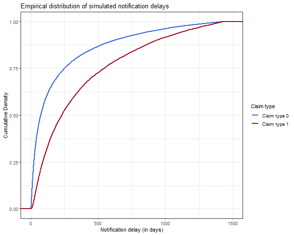
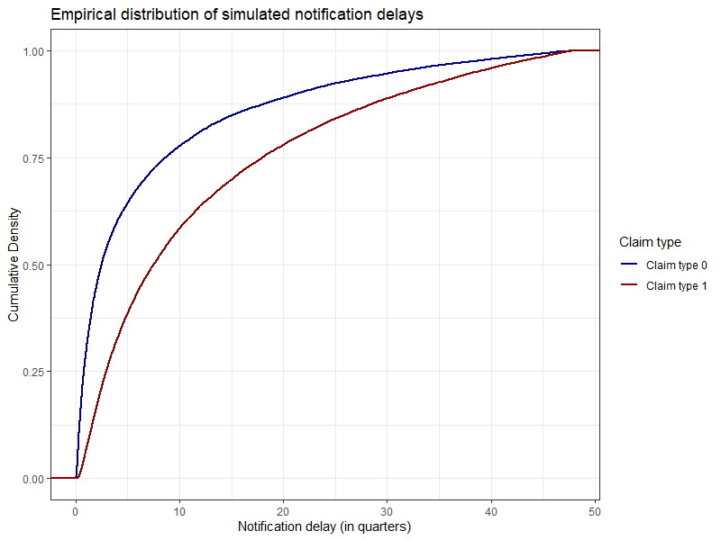
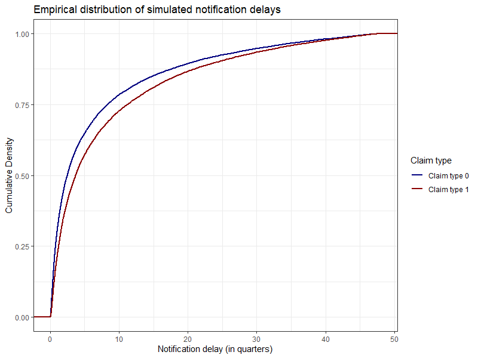
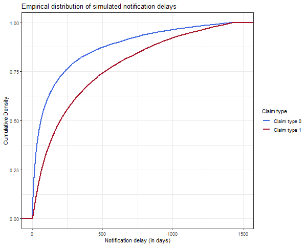
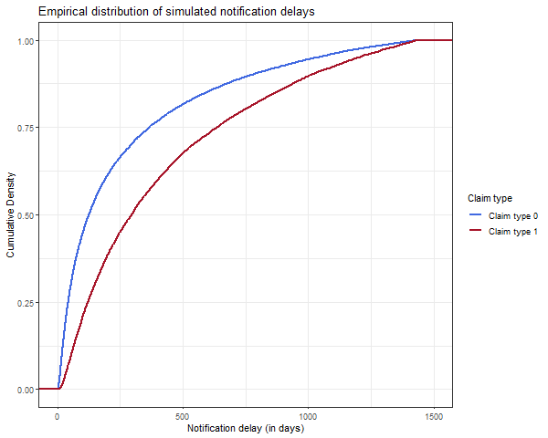

```{r setup, include=FALSE}
knitr::opts_chunk$set(echo = TRUE)
library(ReSurv)
```

# Introduction

In this vignette we show how to simulate the individual data we included in the paper. This simulation are based on the `SynthETIC` package and they can be used to understand our approach.

# Scenario 0

```{r eval=FALSE, include=TRUE}
# Input data

input_data0 <- data_generator(random_seed = 1964,
                              scenario=0)

```


```{r eval=FALSE, include=TRUE}

input_data0 %>%
  as.data.frame() %>%
  mutate(claim_type=as.factor(claim_type))%>%
  ggplot(aes(x=RT-AT, color=claim_type)) +
  stat_ecdf(size=1) +
  labs(title="Empirical distribution of simulated notification delays", 
       x="Notification delay (in quarters)", 
       y="Cumulative Density") +
  xlim(0,48)+
  scale_color_manual(values=c("navyblue", "darkred"),
                     labels=c("Claim type 0","Claim type 1")) +
  scale_linetype_manual(values=c(1,3),
                        labels=c("Claim type 0","Claim type 1"))+
  guides(color = guide_legend(title="Claim type",
                              override.aes = list(color = c("navyblue", "darkred"),
                                                  size = 2)),
         linetype = guide_legend(title="Claim type", 
                                 override.aes = list(linetype = c(1,3),
                                                     size = 0.7))) +
  theme_bw()

```



# Scenario 1

```{r include=TRUE, eval =FALSE}
# Input data

input_data1 <- data_generator(random_seed = 1964,
                             scenario=1)

```

```{r eval=FALSE, include=TRUE}
input_data1 %>%
  as.data.frame() %>%
  mutate(claim_type=as.factor(claim_type))%>%
  ggplot(aes(x=RT-AT, color=claim_type)) +
  stat_ecdf(size=1) +
  labs(title="Empirical distribution of simulated notification delays", 
       x="Notification delay (in quarters)", 
       y="Cumulative Density") +
  xlim(0,48)+
  scale_color_manual(values=c("navyblue", "darkred"),
                     labels=c("Claim type 0","Claim type 1")) +
  scale_linetype_manual(values=c(1,3),
                        labels=c("Claim type 0","Claim type 1"))+
  guides(color = guide_legend(title="Claim type",
                              override.aes = list(color = c("navyblue", "darkred"),
                                                  size = 2)),
         linetype = guide_legend(title="Claim type", 
                                 override.aes = list(linetype = c(1,3),
                                                     size = 0.7))) +
  theme_bw()
```


# Scenario 2

```{r}
# Input data

input_data2 <- data_generator(random_seed = 1964,
                             scenario=2)

```

```{r eval=FALSE, include=TRUE}
input_data2 %>%
  as.data.frame() %>%
  mutate(claim_type=as.factor(claim_type))%>%
  ggplot(aes(x=RT-AT, color=claim_type)) +
  stat_ecdf(size=1) +
  labs(title="Empirical distribution of simulated notification delays", 
       x="Notification delay (in quarters)", 
       y="Cumulative Density") +
  xlim(0,48)+
  scale_color_manual(values=c("navyblue", "darkred"),
                     labels=c("Claim type 0","Claim type 1")) +
  scale_linetype_manual(values=c(1,3),
                        labels=c("Claim type 0","Claim type 1"))+
  guides(color = guide_legend(title="Claim type",
                              override.aes = list(color = c("navyblue", "darkred"),
                                                  size = 2)),
         linetype = guide_legend(title="Claim type", 
                                 override.aes = list(linetype = c(1,3),
                                                     size = 0.7))) +
  theme_bw()
```



# Scenario 3

```{r}
# Input data

input_data3 <- data_generator(random_seed = 1964,
                             scenario=3)

```

```{r eval=FALSE, include=TRUE}
input_data3 %>%
  as.data.frame() %>%
  mutate(claim_type=as.factor(claim_type))%>%
  ggplot(aes(x=RT-AT, color=claim_type)) +
  stat_ecdf(size=1) +
  labs(title="Empirical distribution of simulated notification delays", 
       x="Notification delay (in quarters)", 
       y="Cumulative Density") +
  xlim(0,48)+
  scale_color_manual(values=c("navyblue", "darkred"),
                     labels=c("Claim type 0","Claim type 1")) +
  scale_linetype_manual(values=c(1,3),
                        labels=c("Claim type 0","Claim type 1"))+
  guides(color = guide_legend(title="Claim type",
                              override.aes = list(color = c("navyblue", "darkred"),
                                                  size = 2)),
         linetype = guide_legend(title="Claim type", 
                                 override.aes = list(linetype = c(1,3),
                                                     size = 0.7))) +
  theme_bw()
```


# Scenario 4

```{r}
# Input data

input_data4 <- data_generator(random_seed = 1964,
                             scenario=4)

```


```{r eval=FALSE, include=TRUE}
input_data4 %>%
  as.data.frame() %>%
  mutate(claim_type=as.factor(claim_type))%>%
  ggplot(aes(x=RT-AT, color=claim_type)) +
  stat_ecdf(size=1) +
  labs(title="Empirical distribution of simulated notification delays", 
       x="Notification delay (in quarters)", 
       y="Cumulative Density") +
  xlim(0,48)+
  scale_color_manual(values=c("navyblue", "darkred"),
                     labels=c("Claim type 0","Claim type 1")) +
  scale_linetype_manual(values=c(1,3),
                        labels=c("Claim type 0","Claim type 1"))+
  guides(color = guide_legend(title="Claim type",
                              override.aes = list(color = c("navyblue", "darkred"),
                                                  size = 2)),
         linetype = guide_legend(title="Claim type", 
                                 override.aes = list(linetype = c(1,3),
                                                     size = 0.7))) +
  theme_bw()
```



