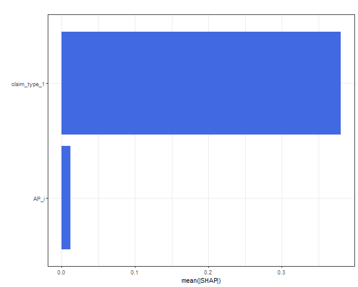
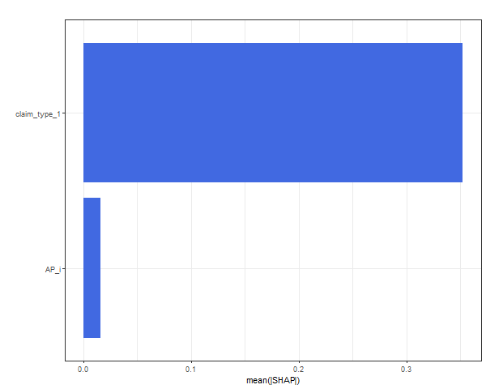
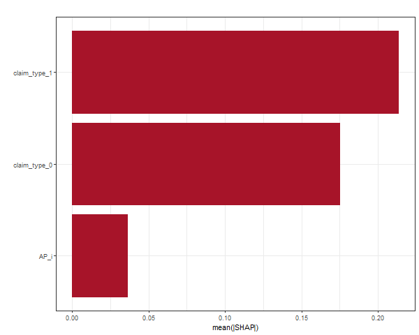
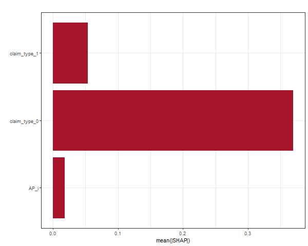

```{r setup, include=FALSE}
knitr::opts_chunk$set(echo = TRUE)
```


```{r setup, include=FALSE}
library(ReSurv)
```

# Introduction 

Machine learning models catch interactions between covariates. Often they are a black-box but they can be interpreted with SHAP values. We generate two data sets, one from scenario Alpha and one from scenario Delta the plotting functionalities of the ReSurv package.

```{r eval=FALSE, include=TRUE}
# Input data scenario Alpha

input_data0 <- data_generator(random_seed = 1,
                              scenario=0,
                              time_unit = 1/360,
                              years = 4,
                              yearly_exposure = 200)

individual_data0 <- IndividualData(data = input_data0,
                                  id=NULL,
                                  categorical_features = c("claim_type"),
                                  continuous_features = "AP",
                                  accident_period="AP",
                                  calendar_period="RP",
                                  input_time_granularity = "days",
                                  output_time_granularity = "quarters",
                                  years=4)

```


```{r eval=FALSE, include=TRUE}
# Input data scenario Delta

input_data3 <- data_generator(random_seed = 1,
                              scenario=3,
                              time_unit = 1/360,
                              years = 4,
                              yearly_exposure = 200)

individual_data3 <- IndividualData(data = input_data3,
                                  id=NULL,
                                  categorical_features = c("claim_type"),
                                  continuous_features = "AP",
                                  accident_period="AP",
                                  calendar_period="RP",
                                  input_time_granularity = "days",
                                  output_time_granularity = "quarters",
                                  years=4)

```


Here we fit Neural Networks and XGB. In order to simplify this vignette, we provide in advance the optimal hyperparameters.

```{r eval=FALSE, include=TRUE}

hp_scenario_alpha_xgb <- list(params=list(booster="gbtree",
                                          eta=0.9887265,
                                          subsample=0.7924135 ,
                                          alpha=10.85342,
                                          lambda=6.213317,
                                          min_child_weight=3.042204,
                                          max_depth = 1),
                                          print_every_n = 0,
                                          nrounds=3000,
                                          verbose=F,
                                          early_stopping_rounds = 500)

hp_scenario_alpha_nn <- list(batch_size=as.integer(5000),
                              epochs=as.integer(5500),
                              num_workers=0,
                              tie='Efron',
                              num_layers=2,
                              num_nodes=10,
                              optim="SGD",
                              batch_size=as.integer(5000),
                              lr=0.3023043,
                              xi=0.426443,
                              eps=0,
                              activation="SELU",
                              early_stopping = TRUE,
                              patience = 350,
                              verbose=F,
                              network_structure = NULL)

hp_scenario_delta_xgb <- list(params=list(booster="gbtree",
                                          eta=0.2717736,
                                          subsample=0.9043068 ,
                                          alpha=7.789214,
                                          lambda=12.09398 ,
                                          min_child_weight=22.4837 ,
                                          max_depth = 4),
                                          print_every_n = 0,
                                          nrounds=3000,
                                          verbose=F,
                                          early_stopping_rounds = 500)

hp_scenario_delta_nn <- list(batch_size=as.integer(5000),
                              epochs=as.integer(5500),
                              num_workers=0,
                              tie='Efron',
                              num_layers=2,
                              num_nodes=2,
                              optim="Adam",
                              batch_size=as.integer(5000),
                              lr=0.3542422,
                              xi= 0.1803953,
                              eps=0,
                              activation="LeakyReLU",
                              early_stopping = TRUE,
                              patience = 350,
                              verbose=F,
                              network_structure = NULL)

```

```{r eval=FALSE, include=TRUE}

resurv.model.xgb.A <-  ReSurv(individual_data0,
                              hazard_model = "xgboost",
                              hparameters=hp_scenario_alpha_xgb)

resurv.model.nn.A <-  ReSurv(individual_data0,
                              hazard_model = "deepsurv",
                              hparameters=hp_scenario_alpha_nn)

resurv.model.xgb.D <-  ReSurv(individual_data3,
                              hazard_model = "xgboost",
                              hparameters=hp_scenario_delta_xgb)

resurv.model.nn.D <- ReSurv(individual_data3,
                              hazard_model = "deepsurv",
                              hparameters=hp_scenario_delta_nn)


```


## Shap values (XGB)

```{r eval=FALSE, include=TRUE}
png(filename = "~/GitHub/ReSurv/vignettes/alpha_shap_xgb.png", width=600, height=480, res=72)
plot(resurv.model.xgb.A)
dev.off()
```


```{r eval=FALSE, include=TRUE}
png(filename = "~/GitHub/ReSurv/vignettes/delta_shap_xgb.png", width=600, height=480, res=72)
plot(resurv.model.xgb.D)
dev.off()
```


## Shap values (NN)

```{r}
png(filename = "~/GitHub/ReSurv/vignettes/alpha_shap_nn.png", width=600, height=480, res=72)
plot(resurv.model.nn.A,nsamples=10000)
dev.off()
```


```{r}
png(filename = "~/GitHub/ReSurv/vignettes/delta_shap_nn.png", width=600, height=480, res=72)
plot(resurv.model.nn.D,nsamples=10000)
dev.off()
```




